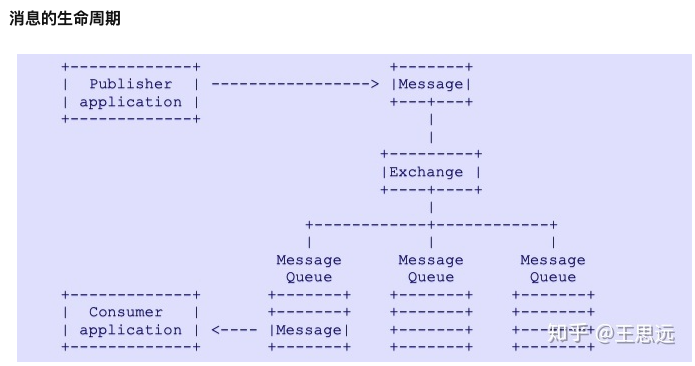

[TOC]
# AMQP协议
AMQP的全称为：Advanced Message Queuing Protocol（高级消息队列协议），AMQP覆盖了网络协议和服务端服务。

## AMQ Model
AMQ model 主要包含三个主要的组件：exchange、message queue、binding
- exchange 从发送者端中读取数据并依据规则路由到消息队列中
- message queue 消息队列作为消息的存储
- binding 定义了exchange和message queue之间的关系，提供了消息路由的规则

在AMQP中，生产者将消息发送到服务端，服务端再把消息路由到邮箱中。消费者直接从邮箱中拉取消息.`但在AMQP中发布者可以把消息直接发布到对应的邮箱中，类似于topic的订阅`。主要原因是用户可以控制消息队列和交换器的绑定规则，而不依赖中间件自身的代码。

1.消息由生产者产生。生产者把内容放到消息里，并设置一些属性以及消息的路由。然后生产者把消息发给服务端。
2.服务端收到消息，交换器（大部分情况）把消息路由到若干个该服务器上的消息队列中。如果这个消息找不到路由，则会丢弃或者退回给生产者（生产者可自行决定）。
3.一条消息可以存在于许多消息队列中。 服务器可以通过复制消息，引用计数等方式来实现。这不会影响互操作性。 但是，将一条消息路由到多个消息队列时，每个消息队列上的消息都是相同的。 没有可以区分各种副本的唯一标识符。
4.消息到达消息队列。消息队列会立即尝试通过AMQP将其传递给消费者。 如果做不到，消息队列将消息存储（按生产者的要求存储在内存中或磁盘上），并等待消费者准备就绪。 如果没有消费者，则消息队列可以通过AMQP将消息返回给生产者（同样，如果生产者要求这样做）。
5.当消息队列可以将消息传递给消费者时，它将消息从其内部缓冲区中删除。 可以立即删除，也可以在使用者确认其已成功处理消息之后删除(ack)。 由消费者选择“确认”消息的方式和时间。消费者也可以拒绝消息（否定确认）。
6.生产者发消息与消费者确认，被分组成一个事务。当一个应用同时扮演多个角色时：发消息，发ack，commit或者回滚事务。消息从服务端投递给消费者这个过程不是事务的。消费者对消息进行确认就够了。

其中不同的协议类型能够发送不同的消息，fanout类型能够以广播的形式进行消息发送。